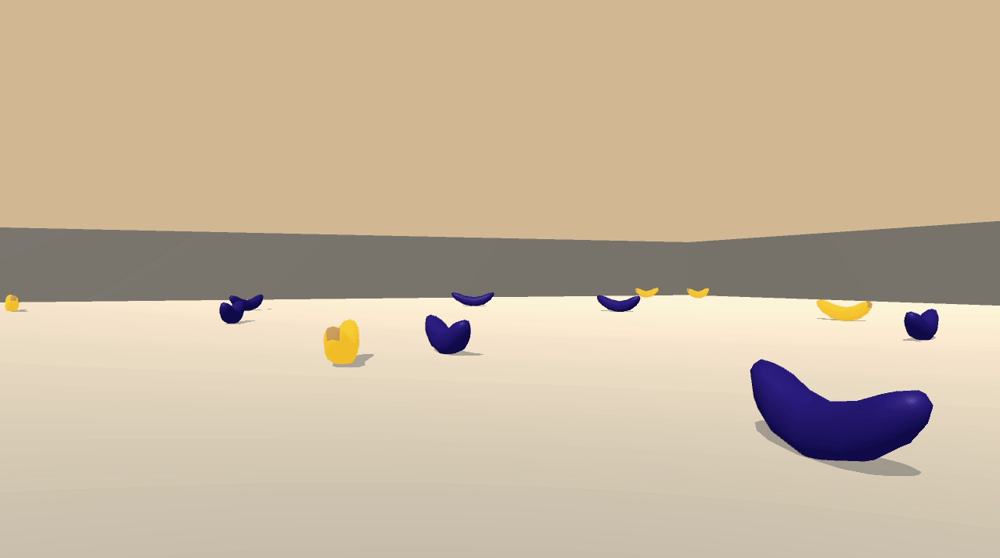

# Project 1: Navigation
## Introduction
This project is the first sumbission task of the
[Deep Reinforcement Learning Nanodegree program](https://www.udacity.com/course/deep-reinforcement-learning-nanodegree--nd893), by Udacity, and in collaboration with Unity and Nvidia.

The main goal of this project is to train an agent to navigate and collect yellow bananas and avoid blue bananas in a large ,square world. This agent is trained under DRL techniques concretely following the

Here it is possible to see the agent collectin bananas and taking its own decisions.

### About Deep Reinforcement learning

> [Reinforcement learning](https://pathmind.com/wiki/deep-reinforcement-learning) refers to goal-oriented algorithms, which learn how to attain a complex objective (goal) or maximize along a particular dimension over many steps, always through the interaction with the environment; for instance, maximize the points won in a game over many moves.
These algorithms can start their learning from scratch, and under the right learning pattern, they can achieve performances over the human possibilities. Like a dog is incentivized by a biscuit-bone, these algorithms are rewarded when they make the right decisiones and penalized when the make the wrong ones - this is the Reinforcement part.
On the other hand, the part that helps to the agent to take decisions based on its own experience is based on [Neural Network Algorithms](https://pathmind.com/wiki/neural-network) - this is the deep learning part.

## First steps in the environment
All the project has been built and developed using the **Unity Machine Learning Agents Toolkit (ML-Agents)**, which is an open-source Unity plugin that enables games and simulations to serve as envirnments for training intelligent agents. You can read further about ML-agents by perusing the [GitHub repository](https://github.com/Unity-Technologies/ml-agents).

Note: The project environment provided by Udacity is similar to, but not indentical to the [Banana Collector](https://github.com/Unity-Technologies/ml-agents/blob/master/docs/Learning-Environment-Examples.md#banana-collector) environment
