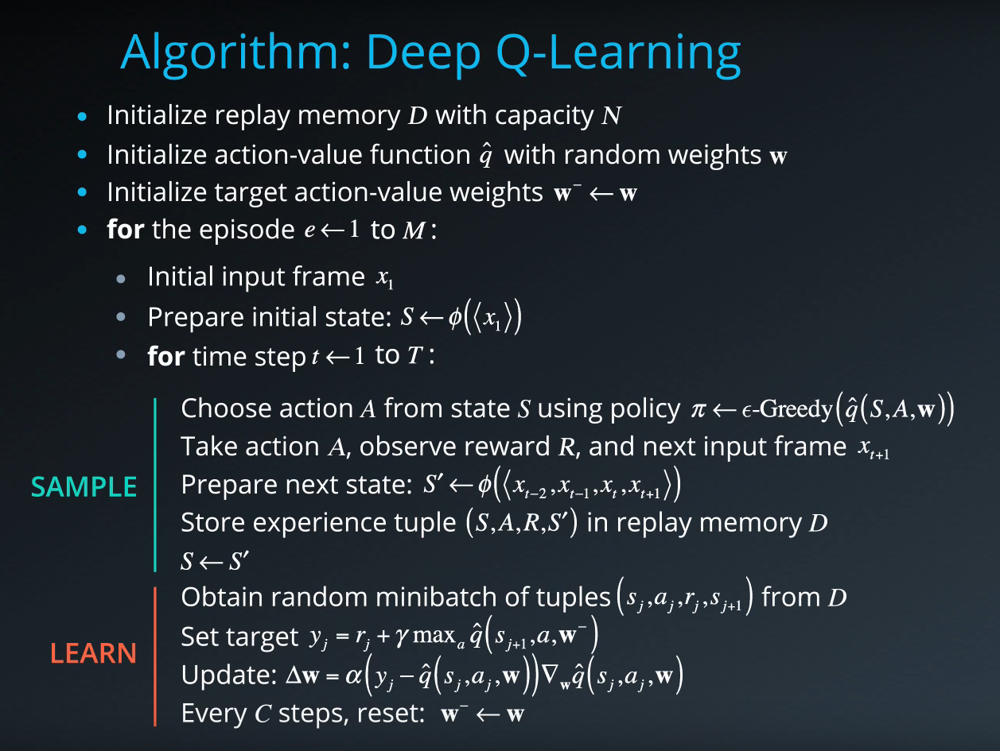

# Banana Frenzy Agent

## Project's goal

In this project, **the goal is to train an agent to navigate a virtual world and collect as many yellow bananas as possible while avoiding blue bananas**

## 1. Environment details

The environment is based on [Unity ML-agents](https://github.com/Unity-Technologies/ml-agents)

Note: The project environment provided by Udacity is similar to, but not identical to the Banana Collector environment on the Unity ML-Agents GitHub page.

> The Unity Machine Learning Agents Toolkit (ML-Agents) is an open-source Unity plugin that enables games and simulations to serve as environments for training intelligent agents. Agents can be trained using reinforcement learning, imitation learning, neuroevolution, or other machine learning methods through a simple-to-use Python API.

A reward of +1 is provided for collecting a yellow banana, and a reward of -1 is provided for collecting a blue banana. Thus, the goal of the agent is to collect as many yellow bananas as possible while avoiding blue bananas.

The state space has 37 dimensions and contains the agent's velocity, along with ray-based perception of objects around the agent's forward direction.

Given this information, the agent has to learn how to best select actions. Four discrete actions are available, corresponding to:

- `0` - move forward.
- `1` - move backward.
- `2` - turn left.
- `3` - turn right.

The task is episodic, and **in order to solve the environment, the agent must get an average score of +13 over 100 consecutive episodes.**

## 2. Agent Implementation

### Deep Q-Networks

This project implements a *Value Based* method called [Deep Q-Networks](https://deepmind.com/research/dqn/).

Deep Q Learning combines 2 approaches :
- A Reinforcement Learning method called [Q Learning](https://en.wikipedia.org/wiki/Q-learning) (aka SARSA max)
- A Deep Neural Network to learn a Q-table approximation (action-values)

Especially, this implementation includes the 2 major training improvements by [Deepmind](https://deepmind.com) and described in their [Nature publication : "Human-level control through deep reinforcement learning (2015)"](https://storage.googleapis.com/deepmind-media/dqn/DQNNaturePaper.pdf)
- Experience Replay
- Fixed Q Targets

> Reinforcement learning is known to be unstable or even to diverge when a nonlinear function approximator such as a neural network is used to represent the action-value (also known as Q) function20. This instability has several causes: the correlations present in the sequence of observations, the fact that small updates to Q may significantly change the policy and therefore change the data distribution, and the correlations
between the action-values and the target values .
We address these instabilities with a novel variant of Q-learning, which uses two key ideas. First, we used a biologically inspired mechanism termed experience replay that randomizes over the data, thereby removing correlations in the observation sequence and smoothing over changes in the data distribution. Second, we used an iterative update that adjusts the action-values towards target values that are only periodically updated, thereby reducing correlations with the target.

#### Algorithm

This algorithm screenshot is taken from the [Deep Reinforcement Learning Nanodegree course](https://www.udacity.com/course/deep-reinforcement-learning-nanodegree--nd893)

The implementation of the algorithm may be found in [here](model.py)
