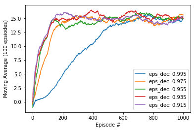

# Banana Frenzy Agent

## Project's goal

In this project, **the goal is to train an agent to navigate a virtual world and collect as many yellow bananas as possible while avoiding blue bananas**


## 1. Environment details

The environment is based on [Unity ML-agents](https://github.com/Unity-Technologies/ml-agents)

Note: The project environment provided by Udacity is similar to, but not identical to the Banana Collector environment on the Unity ML-Agents GitHub page.

> The Unity Machine Learning Agents Toolkit (ML-Agents) is an open-source Unity plugin that enables games and simulations to serve as environments for training intelligent agents. Agents can be trained using reinforcement learning, imitation learning, neuroevolution, or other machine learning methods through a simple-to-use Python API.

A reward of +1 is provided for collecting a yellow banana, and a reward of -1 is provided for collecting a blue banana. Thus, the goal of the agent is to collect as many yellow bananas as possible while avoiding blue bananas.

The state space has 37 dimensions and contains the agent's velocity, along with ray-based perception of objects around the agent's forward direction.

Given this information, the agent has to learn how to best select actions. Four discrete actions are available, corresponding to:

- `0` - move forward.
- `1` - move backward.
- `2` - turn left.
- `3` - turn right.

The task is episodic, and **in order to solve the environment, the agent must get an average score of +13 over 100 consecutive episodes.**

## 2. Agent Implementation
Agents use a policy to decide which actions to take within an environment. The primary objective of the learning algorithm is to find an optimal policy&mdash;i.e., a policy that maximizes the reward for the agent. Since the effects of possible actions aren't known in advance, the optimal policy must be discovered by interacting with the environment and recording observations. Therefore, the agent "learns" the policy through a process of trial-and-error that iteratively maps various environment states to the actions that yield the highest reward. This type of algorithm is called **Q-Learning**.

As for constructing the Q-Learning algorithm, the general approach is to implement a handful of different components, then run a series of tests to determine which combination of components and which hyperparameters yield the best results.

In the following sections, we'll describe each component of the algorithm in detail.

### Deep Q-Networks

#### Q-Function
To discover an optimal policy, it is setup a Q-function. The Q-function calculates the expected reward `R` for all possible actions `A` in all possible states `S`.


We can then define our optimal policy `π*` as the action that maximizes the Q-function for a given state across all possible states. The optimal Q-function `Q*(s,a)` maximizes the total expected reward for an agent starting in state `s` and choosing action `a`, then following the optimal policy for each subsequent state.


In order to discount returns at future time steps, the Q-function can be expanded to include the hyperparameter gamma `γ`.


#### Epsilon-Greedy Algorithm
One challenge with the Q-function above is choosing which action to take while the agent is still learning the optimal policy. Should the agent choose an action based on the Q-values observed thus far? Or, should the agent try a new action in hopes of earning a higher reward? This is known as the **exploration vs. exploitation dilemma**.

To address this, it has been implemented an **𝛆-greedy algorithm**. This algorithm allows the agent to systematically manage the exploration vs. exploitation trade-off. The agent "explores" by picking a random action with some probability epsilon `𝛜`. However, the agent continues to "exploit" its knowledge of the environment by choosing actions based on the policy with probability (1-𝛜).

Furthermore, the value of epsilon is purposely decayed over time, so that the agent favors exploration during its initial interactions with the environment, but increasingly favors exploitation as it gains more experience. The starting and ending values for epsilon, and the rate at which it decays are three hyperparameters that are later tuned during experimentation.

You can find the 𝛆-greedy logic implemented as part of the `agent.act()` method [here](C:\Users\rovaa\github\DRL_p1_navigation_Udacity\agent.py#L65) in `agent.py` of the source code.

#### Deep Q-Network (DQN)
With Deep Q-Learning, a deep neural network is used to approximate the Q-function. Given a network `F`, finding an optimal policy is a matter of finding the best weights `w` such that `F(s,a,w) ≈ Q(s,a)`.

The neural network architecture used for this project can be found [here](C:\Users\rovaa\github\DRL_p1_navigation_Udacity\model.py#L5) in the `model.py` file of the source code. The network contains three fully connected layers with 64, 64, and 4 nodes respectively. Testing of bigger networks (more nodes) and deeper networks (more layers) did not produce better results.

As for the network inputs, rather than feeding-in sequential batches of experience tuples, I randomly sample from a history of experiences using an approach called Experience Replay.

##### Algorithm implementation


This algorithm screenshot is taken from the [Deep Reinforcement Learning Nanodegree course](https://www.udacity.com/course/deep-reinforcement-learning-nanodegree--nd893)

The implementation of the algorithm may be found in [here](model.py)

### Enhanced Variants of DQN algorithm

The following variants are intended to cover issues of the basic performance of DQN algorithm, trying to enhance that performance.

#### Double Deep Q-Network (DDQN)
One issue with Deep Q-Networks is they can overestimate Q-values (see [Thrun & Schwartz, 1993](https://www.ri.cmu.edu/pub_files/pub1/thrun_sebastian_1993_1/thrun_sebastian_1993_1.pdf)). The accuracy of the Q-values depends on which actions have been tried and which states have been explored. If the agent hasn't gathered enough experiences, the Q-function will end up selecting the maximum value from a noisy set of reward estimates. Early in the learning process, this can cause the algorithm to propagate incidentally high rewards that were obtained by chance (exploding Q-values). This could also result in fluctuating Q-values later in the process.


We can address this issue using Double Q-Learning, where one set of parameters `w` is used to select the best action, and another set of parameters `w'` is used to evaluate that action.  


The DDQN implementation can be found [here](C:\Users\rovaa\github\DRL_p1_navigation_Udacity\agent.py#L97) in the `agent.py` file of the source code.


#### Dueling Agents
Dueling networks utilize two streams: one that estimates the state value function `V(s)`, and another that estimates the advantage for each action `A(s,a)`. These two values are then combined to obtain the desired Q-values.  


The reasoning behind this approach is that state values don't change much across actions, so it makes sense to estimate them directly. However, we still want to measure the impact that individual actions have in each state, hence the need for the advantage function.

The dueling agents are implemented within the fully connected layers [here](C:\Users\rovaa\github\DRL_p1_navigation_Udacity\model.py#L36) in the `model.py` file of the source code.

##### &nbsp;

## 3. Adjusting the Hyperparameters
To experiment with how the Agent learns through distinct parameters, you can tune these variables:  

**1.** In the **Navigation.ipynb** file  

* **n_episodes**: Maximum number of training episodes
* **max_t**: Maximum number of timesteps per episode
* **eps_start**: Starting value of epsilon, for epsilon-greedy action selection
* **eps_end**: Minimum value of epsilon. (Eps-Greedy Ploicy)
* **eps_decay**: Multiplicative factor (per episode) for decreasing epsilon  
* **train_mode(bool)**: if 'True' set environment to training mode. (Instead of just execute trained weights)
* **ckt_path(string)**: It is the path where have to be saved the weights of the trained agent
* **episode_Stop(bool)**: if True, the simulation stops when target is reached.
* **save_weights(bool)**: if 'True' save weights of the trained model.


**2.** In the **dqn_agent.py** file

* **BUFFER_SIZE**: Replay buffer size
* **BATCH_SIZE**: Minibatch size
* **GAMMA**: Discount factor for expected rewards
* **TAU**: Multiplicative factor for updating the target network weights
* **LR**: Learning rate
* **UPDATE_EVERY**: How often to update the network

## 4. Results obtained

There have been carried out several tests to evaluate different performance

### DQN algorithm performance


First of all it has been tested the number of episodes in which the algorithm gets the 13 average scores in the last 100 episodes. Without DoubleDQN or Duelling and with the standard hyperparameters proposed in the DRL Udacity course.
```
n_episodes: 1000
max_t:1000
eps_start:1.0
eps_end:0.01
eps_decay:0.995
train_mode(bool):True
ckt_path(string):pth_checkpoints/checkpoint.pth
target_Stop(bool):True
save_weights(bool):True
```

```
Episode 100	Average Score: 1.03
 Saving weights at episode 100
Episode 200	Average Score: 4.31
 Saving weights at episode 200
Episode 300	Average Score: 7.80
 Saving weights at episode 300
Episode 400	Average Score: 10.74
 Saving weights at episode 400
Episode 500	Average Score: 12.91
 Saving weights at episode 500
Episode 516	Average Score: 13.01
Environment solved in 416 episodes!	Average Score: 13.01

Total Training time = 10.9 min
```

### DQN algorithm eps_Decay sensibility tests
In this test it is measured the sensibility to the eps_Decay value and to evaluate the average scores evolution in the episodes.
```
n_episodes: 1000
max_t:1000
eps_start:1.0
eps_end:0.01
eps_decay=[0.995, 0.975, 0.955, 0.935, 0.915]
train_mode(bool):True
ckt_path(string):pth_checkpoints/checkpoint.pth
target_Stop(bool):True
save_weights(bool):True
```



### DDQN algorithm performance
The evaluation of the DDQN algorithm performance
```
n_episodes: 1000
max_t:1000
eps_start:1.0
eps_end:0.01
eps_decay:0.995
train_mode(bool):True
ckt_path(string):pth_checkpoints/checkpoint_DDQN.pth
target_Stop(bool):True
save_weights(bool):True
```


```
Episode 100	Average Score: 2.72
 Saving weights at episode 100
Episode 200	Average Score: 8.23
 Saving weights at episode 200
Episode 300	Average Score: 12.63
 Saving weights at episode 300
Episode 310	Average Score: 13.00
Environment solved in 210 episodes!	Average Score: 13.00
```

### Duelling algorithm performance

```
n_episodes: 1000
max_t:1000
eps_start:1.0
eps_end:0.01
eps_decay=[0.995, 0.975, 0.955, 0.935, 0.915]
train_mode(bool):True
ckt_path(string):pth_checkpoints/checkpoint.pth
target_Stop(bool):True
save_weights(bool):True
```
### DDQN and Duelling algorithm performance

```
n_episodes:
max_t:
eps_start:
eps_end:
eps_decay:
train_mode(bool):
ckt_path(string):
episode_Stop(bool):
save_weights(bool):
```
### Trained agent
For DDQN and Duelling algorithm, it is shown the
(Ver Silviomori)


## 5. Future lines of work

- **Evaluate more hyperparameters sensibility** &mdash; As it has been evaluated the performance of the algorithm for several eps_deacys values, it could be tested other hyperparamenters as the mínimum or maximum value of epsilon.
- **Test the replay buffer** &mdash; Implement a way to enable/disable the replay buffer. As mentioned before, all agents utilized the replay buffer. Therefore, the test results don't measure the impact the replay buffer has on performance.
- **Add *prioritized* experience replay** &mdash; Rather than selecting experience tuples randomly, prioritized replay selects experiences based on a priority value that is correlated with the magnitude of error. This can improve learning by increasing the probability that rare and important experience vectors are sampled. The prioritized experience replay is explained in more detail in [here](https://arxiv.org/abs/1511.05952).
- **Implementing multi-step bootstrap targets** &mdash; This approach is explained [here](https://arxiv.org/abs/1602.01783).

##### &nbsp;
##### &nbsp;
